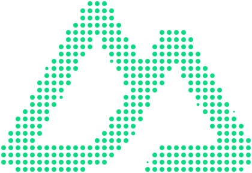

<div align="center">
  
</div>

<div align="center">

# Halograph

[![npm version][npm-version-src]][npm-version-href]
[![npm downloads][npm-downloads-src]][npm-downloads-href]
[![License][license-src]][license-href]
[![Nuxt][nuxt-src]][nuxt-href]

</div>

Nuxt module that turns any image (including SVG) into a halftone: a grid of single-color dots with even spacing. Brightness is encoded by dot size, opacity, or both.

**Minimal dependencies, maximum performance.**

## Features

- **Halftone effects** - scale (dot size), opacity, or both
- **Flexible coloring** - solid or gradient (2 or 3 colors); HEX, HSL, RGB(a), OKLCH
- **Gradient control** - direction in degrees, 2- or 3-color mode
- **Dot shapes** - circle, square, triangle
- **Output** - canvas or PNG image
- **CORS** - optional server proxy for external images
- **Slots** - `#loading`, `#error`
- **Performance** - `maxWidth`/`maxHeight`, Web Worker for large images (>512×512px), optional smoothing, trim, hideMinDots

## Installation

```bash
npx nuxi module add halograph
```

Or manually:

```bash
npm install halograph
```

```typescript
// nuxt.config.ts
export default defineNuxtConfig({
  modules: ['halograph'],
})
```

## Usage

### Component

```vue
<template>
  <HalographImage
    src="https://example.com/image.jpg"
    :options="halftoneOptions"
    output="canvas"
  />
</template>

<script setup lang="ts">
import type { HalftoneOptions } from 'halograph'

const halftoneOptions: HalftoneOptions = {
  dotType: 'circle',
  effectType: 'scale',
  color: '#1a1a1a',
  spacing: 8,
  maxWidth: 600,
}
</script>
```

**Props**

| Prop      | Type                   | Default   | Description    |
|-----------|------------------------|-----------|----------------|
| `src`     | `string`               | -         | Image URL      |
| `options` | `HalftoneOptions`      | -         | Effect options |
| `output`  | `'canvas' \| 'image'`  | `'canvas'`| Output format  |

**Slots** - `#loading`, `#error` (receives `error`).

### Composable

```vue
<script setup lang="ts">
import { useHalograph } from 'halograph'

const src = '/image.jpg'
const options = {
  dotType: 'circle',
  effectType: 'scale',
  color: '#000000',
}

const { result, error, isLoading, toDataURL } = useHalograph(src, options)

const pngUrl = toDataURL('image/png')
</script>
```

**Returns:** `result`, `error`, `isLoading`, `toDataURL(type?)`.

## Options

| Option          | Type                    | Default   | Description                    |
|-----------------|-------------------------|-----------|--------------------------------|
| `dotType`       | `'circle' \| 'square' \| 'triangle'` | `'circle'` | Dot shape              |
| `effectType`    | `'scale' \| 'opacity' \| 'both'`     | `'scale'` | Brightness encoding   |
| `color`         | `string`                | `'#000000'` | Dot color (HEX/RGB/HSL/OKLCH) |
| `colorMode`     | `'solid' \| 'gradient2' \| 'gradient3'` | `'solid'` | Coloring mode   |
| `gradientColors`| `[string, string]` or 3-tuple | -     | Gradient stops                 |
| `gradientAngle` | `number`                | `90`      | Gradient direction (degrees)  |
| `spacing`       | `number`                | auto      | Distance between dots (px)     |
| `maxWidth`      | `number`                | -         | Max width for performance      |
| `maxHeight`     | `number`                | -         | Max height for performance     |
| `smoothing`     | `boolean`               | `false`   | Supersampling for antialiasing |
| `trim`          | `boolean`               | `false`   | Crop canvas to content bounds (brightness > threshold) |
| `hideMinDots`   | `boolean`               | `false`   | Do not draw dots at minimum size/opacity (by effect type) |

## Effect types

### `scale` (default)
Dark areas = larger dots. Dot size reflects brightness.

```typescript
{ effectType: 'scale', color: '#000' }
```

### `opacity`
Dark areas = more transparent dots. Fixed size, opacity reflects brightness.

```typescript
{ effectType: 'opacity', color: '#ff0000' }
```

### `both`
Size and opacity both vary with brightness.

```typescript
{ effectType: 'both', color: '#0000ff' }
```

## Coloring

### Solid
```typescript
{ color: '#1a1a1a', colorMode: 'solid' }
```

### Gradient (2 colors)
```typescript
{
  colorMode: 'gradient2',
  gradientColors: ['#ff0000', '#0000ff'],
  gradientAngle: 45,
}
```

### Gradient (3 colors)
```typescript
{
  colorMode: 'gradient3',
  gradientColors: ['#ff0000', '#00ff00', '#0000ff'],
  gradientAngle: 90,
}
```

## CORS and proxy

For images from other domains, enable the proxy:

```typescript
// nuxt.config.ts
export default defineNuxtConfig({
  halograph: { useProxy: true },
})
```

The component will use `/api/_halograph/proxy` for external URLs.

## Performance

### Large images
```typescript
const options: HalftoneOptions = {
  dotType: 'circle',
  effectType: 'scale',
  color: '#000',
  maxWidth: 800,
  maxHeight: 600,
  smoothing: false,
}
```

### Smoothing (supersampling)
Improves quality at the cost of speed:
```typescript
{ smoothing: true }
```

### Trim
Crops canvas to the bounding box of cells with brightness above threshold:
```typescript
{ trim: true }
```

### Hide min dots
Skips drawing dots at minimum size (scale) or minimum opacity (opacity/both):
```typescript
{ hideMinDots: true }
```

## Exported types

```typescript
import type {
  HalftoneOptions,
  HalftoneResult,
  DotType,
  EffectType,
  ColorMode,
} from 'halograph'
```

## License

MIT © 2025

[npm-version-src]: https://img.shields.io/npm/v/halograph
[npm-version-href]: https://npmjs.com/package/halograph
[npm-downloads-src]: https://img.shields.io/npm/dm/halograph
[npm-downloads-href]: https://npmjs.com/package/halograph
[license-src]: https://img.shields.io/github/license/sharikfi/halograph
[license-href]: LICENSE
[nuxt-src]: https://img.shields.io/badge/Nuxt-v4-18181b
[nuxt-href]: https://nuxt.com
